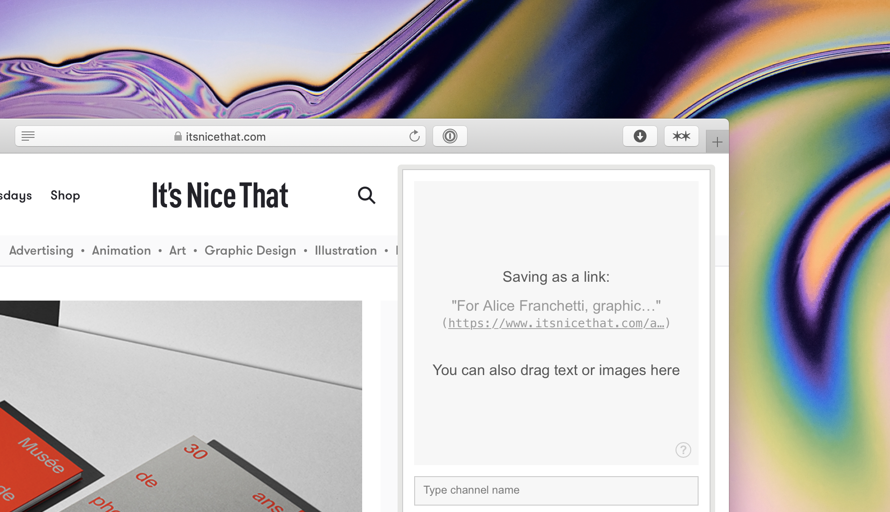

# Are.na Extension for Safari

Adds a native button to Safari to open the bookmarklet. It's just wrapping the bookmarklet at this point, so no right click actions like the chrome plugin.

[Download the latest version](https://github.com/joshuasoehn/Are.na-Safari-Extension/releases/latest/download/Are.na.for.Safari.app.zip)
